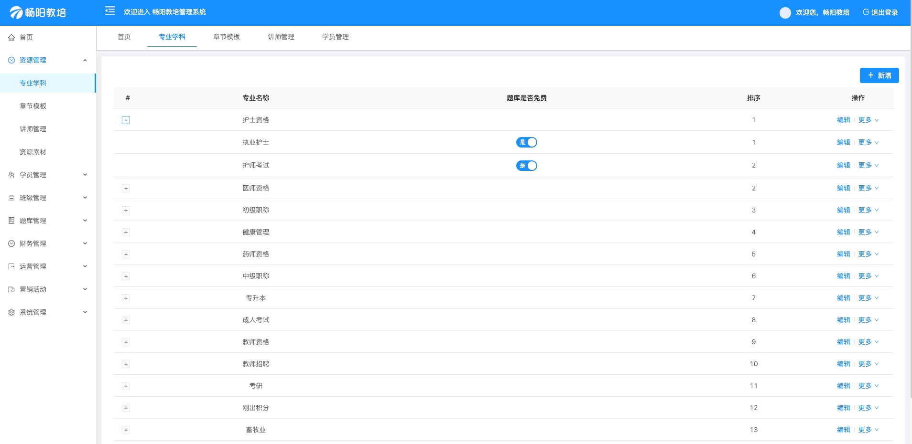
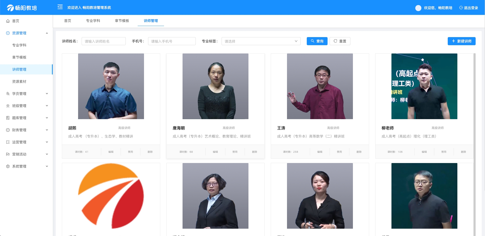
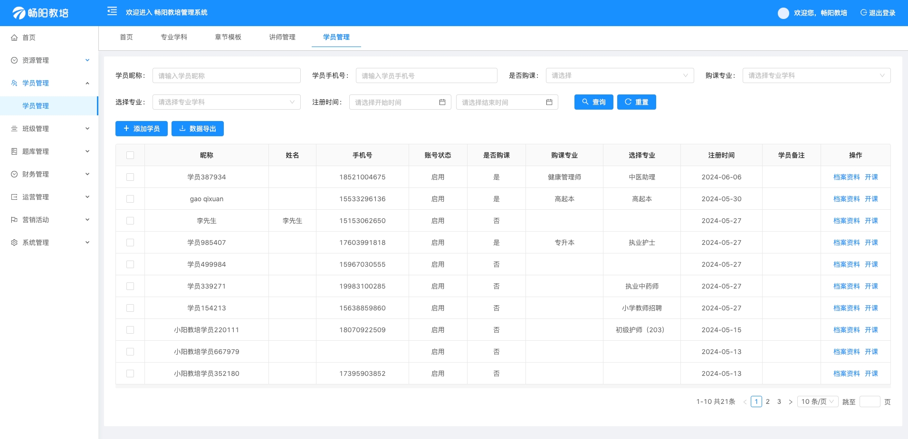
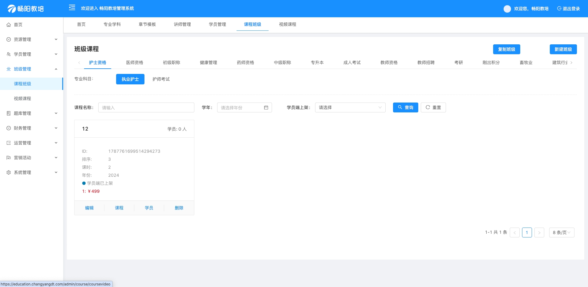
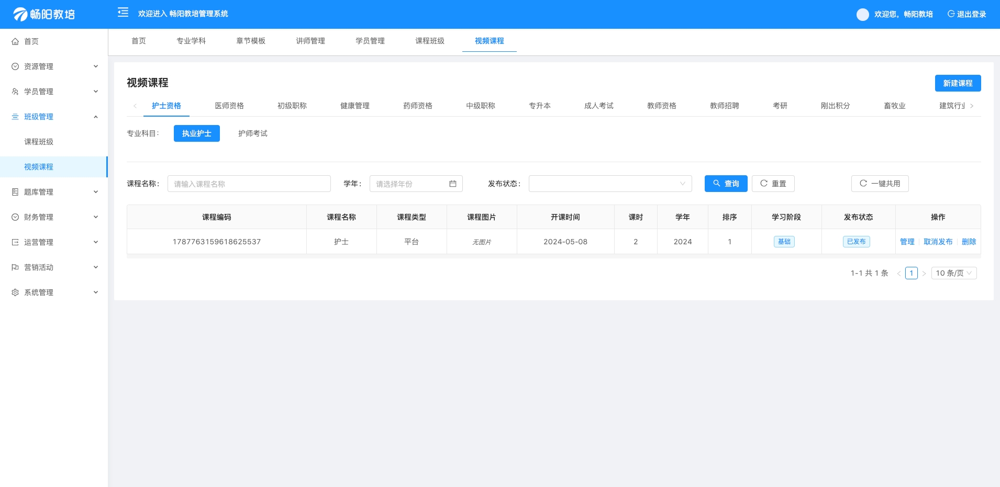
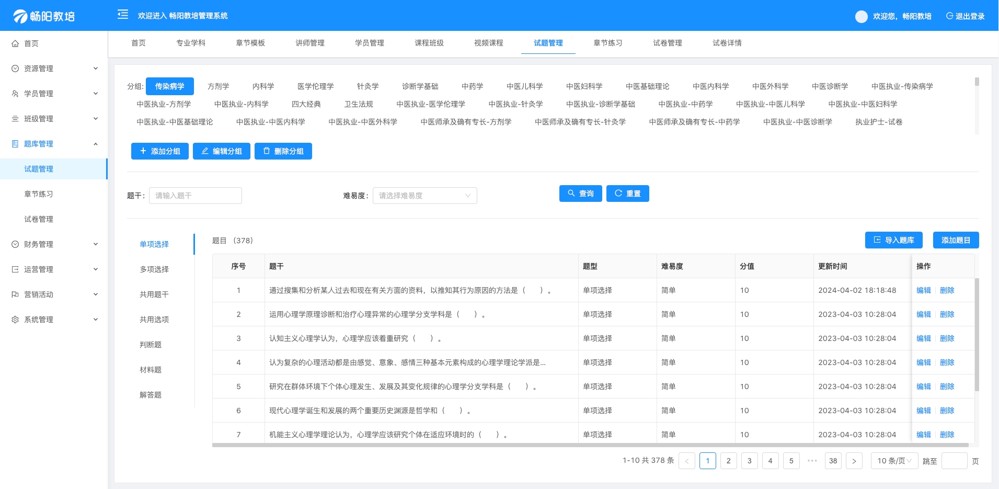
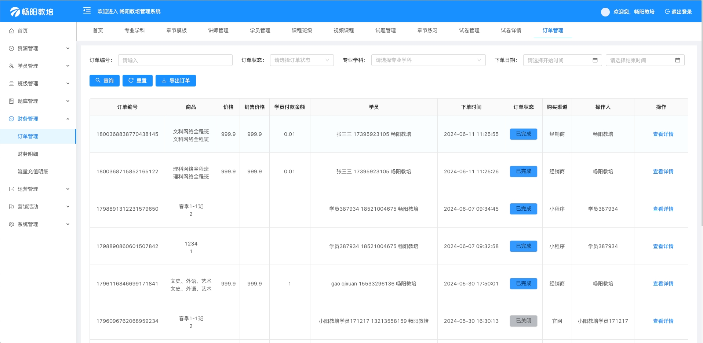
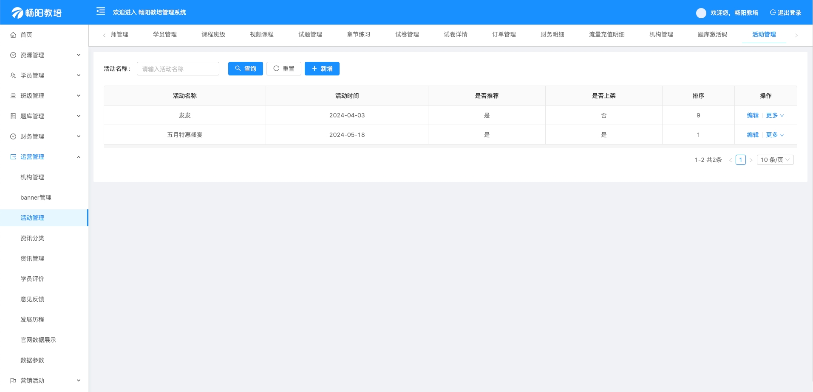

<p align="center">
  <a href="https://github.com/ChangyangOpenSource/education-training-system/">
    
  </a>
  <h3 align="center">教育培训行业解决方案</h3>
  <p align="center">
    一键式搭建属于自己的在线教育平台
    <br />
  </p>

</p>

## 目录

- [项目介绍](#项目介绍)
  - [官方网站](#官方网站)
- [软件架构](#软件架构)
- [快速入门](#快速入门)
- [功能展示](#功能展示)
- [更新日志](#更新日志)
- [许可证](#许可证)
- [联系我们](#联系我们)

## 项目介绍

在线教培系统是畅阳科技的重要开源项目之一，支持多种形式的在线教学，包括课程，题库，考试等。通过使用该系统，用户可以轻松创建自己的在线教育平台，并提供多样化的教学内容，满足不同用户的需求。

### 官方网站

[官网地址](https://changyangdt.com/)

## 软件架构

本系统采用前后端分离模式开发和运行。前端使用vue框架并基于 Ant Design Of Vue 组件库进行开发。后端使用 springboot + redis + mysql 进行搭建　可单机运行也可集群运行。 对大中小型培训机构的使用均没有压力。　

#### 环境配置要求：

- 语言：Java 8+ (小于17)

- IDE(JAVA)： IDEA (必须安装lombok插件 )

- IDE(前端)： Vscode、WebStorm、IDEA

- 依赖管理：Maven

- 缓存：Redis

- 数据库脚本：MySQL5.7+  &  Oracle 11g & Sqlserver2017（其他数据库，[需要自己转](https://my.oschina.net/jeecg/blog/4905722)）

#### 后端

- 基础框架：Spring Boot 2.6.6

- 微服务框架： Spring Cloud Alibaba 2021.0.1.0

- 持久层框架：MybatisPlus 3.5.1

- 报表工具： JimuReport 1.5.8

- 安全框架：Apache Shiro 1.10.0，Jwt 3.11.0

- 微服务技术栈：Spring Cloud Alibaba、Nacos、Gateway、Sentinel、Skywalking

- 数据库连接池：阿里巴巴Druid 1.1.22

- 日志打印：logback

- 其他：autopoi, fastjson，poi，Swagger-ui，quartz, lombok（简化代码）等。


#### 前端

- Vue2版本：`Vue2.6+@vue/cli+AntDesignVue+Viser-vue+Vuex等`
- node版本: 16.18.1

## 快速入门
以下指南将帮助你在本地机器上安装和运行该项目，进行开发和测试

### 安装步骤：
1.克隆仓库
```bash
git clone https://github.com/ChangyangOpenSource/education-training-system.git
```
2.安装依赖
```bash
npm install
```
3.运行项目

```bash
npm run dev
```
## 功能展示
### 学员端小程序
   
### 运营商web管理后台
- 专业学科
    
- 讲师管理
   
- 学员管理
    
- 课程班级
   
- 视频课程
    
- 试题管理
   
- 订单管理
    
- 活动管理
   

### 微信小程序体验版

   

## 更新日志

### 20240607 更新畅阳教培用户端微信小程序
- 增加 流量到期提示弹窗
- 修复 题库-历年真题页面跳转异常的情况
- 畅阳教培用户端pc官网
- 增加 流量到期提示弹窗

## 许可证

[License MIT](./LICENSE)

## 联系我们 
* 如果您想使用功能更完善的教育系统，请联系以下企业微信！
* 如果您想基于教育系统进行定制开发，我们提供有偿定制服务支持！
* 其他合作模式不限，欢迎来撩！

